# Colombia 2026 Hybrid ABM–LLM Runoff Simulation

> **Research-use warning:** This repository contains a synthetic computational experiment. It is not an opinion poll, an electoral forecast, a representative estimate, a causal media-effects study, or a measurement of real human cognition.

## Overview

This project models a twenty-day Colombian presidential-runoff information environment through two linked layers:

1. a heuristic agent-based model (ABM) with 1,000 heterogeneous synthetic agents; and
2. a post-ABM cognitive deliberation layer using Anthropic Claude and agent-specific cognitive dossiers.

The analytical chain is:

**information ingestion → interpretation and memory → semantic reframing → social transmission → emergence → synthetic voting state → LLM deliberation**

The model studies mechanisms of selective exposure, source trust, finite memory, narrative diffusion, bounded-confidence interaction, information entropy, linguistic variation, and decision revision. Geography, demographic profiles, language markers, and media diets are heterogeneity attributes inside a synthetic population; they are not direct estimates for real regions or demographic groups.

## Research question

How can a source-audited information environment, heterogeneous media diets, adaptive trust, semantic memory, and multiplex social interaction generate emergent changes in synthetic voting states during a compressed runoff campaign?

## Experimental contract

| Component | Value |
|---|---:|
| Synthetic agents | 1,000 |
| Simulation window | 1–20 June 2026 |
| Election boundary | 21 June 2026 |
| Daily resolution | 1 day |
| Master observations | 207 |
| Canonical signals | 201 |
| Supporting observations | 6 |
| Event clusters | 201 |
| Source categories | 9 |
| ABM random seed | 42 |
| Network layers | 4 multiplex layers |
| LLM provider in executed run | Anthropic Claude |
| LLM temperature | 0.35 |
| Maximum LLM output tokens | 1,200 |

The original input package has a Colombia-time cutoff of `2026-06-20T23:59:59-05:00`.

## Architecture

```mermaid
flowchart LR
    A[Audited source package v5.1] --> B[Event and source validation]
    B --> C[Daily information environment]
    C --> D[1,000 synthetic agents]
    D --> E[Direct exposure and interpretation]
    E --> F[Trust and motif memory]
    F --> G[Multiplex social transmission]
    G --> H[Daily ABM state transition]
    H --> I[Emergence and attribution metrics]
    I --> J[Cognitive dossier per agent]
    J --> K[Claude structured deliberation]
    K --> L[ABM vs LLM comparison]
    L --> M[Dashboard and release artifacts]
```



The LLM stage occurs after the twenty-day heuristic simulation and does not feed back into the original ABM trajectory.

## Repository structure

```text
.
├── .github/                 GitHub Actions and contribution templates
├── configs/                 Reproducible ABM and LLM configuration examples
├── data/                    Audited source package and extracted inspection copy
├── docs/                    GitHub Pages dashboard and downloadable tables
├── methodology/             ODD+D specification, model card, data card, validation and ethics
├── notebooks/               Publication notebook with outputs removed
├── results/                 Dashboard tables and lightweight samples
├── scripts/                 Validation, publishing and checksum utilities
├── tests/                   Automated integrity tests
├── releases/                Instructions for attaching large artifacts to GitHub Releases
├── CITATION.cff
├── LICENSE
├── LICENSE-DATA.md
├── requirements.txt
└── pyproject.toml
```

## Quick start

### 1. Clone and create an environment

```bash
git clone <repository-url>
cd abm-colombia-2026-runoff-20-day-simulation
python -m venv .venv
source .venv/bin/activate       # Windows: .venv\Scripts\activate
python -m pip install --upgrade pip
python -m pip install -r requirements.txt
```

### 2. Validate the supplied research artifacts

```bash
python scripts/validate_data_package.py
python scripts/validate_results.py
pytest
```

### 3. Run the notebook locally

```bash
export COLOMBIA_ABM_PACKAGE_PATH="$PWD/data/raw/colombia_2026_source_balanced_v5_1_methodological_audit.zip"
export COLOMBIA_HYBRID_PROFILE="FULL"
export ANTHROPIC_API_KEY="your-key"        # only when running the optional LLM phase
export CLAUDE_MODEL="claude-sonnet-4-6"    # replace only when intentionally changing the experiment
jupyter lab notebooks/Colombia_2026_Presidential_Runoff_The_20_Day_Simulation.ipynb
```

The notebook is Colab-first but supports a local package path through `COLOMBIA_ABM_PACKAGE_PATH`. Never commit API credentials, raw request files containing secrets, or temporary runtime directories.

## Reproduction profiles

- `SMOKE`: 30 agents, intended for structural testing.
- `PILOT`: 200 agents, intended for intermediate validation.
- `FULL`: 1,000 agents, the published experimental resolution.

Set the profile with:

```bash
export COLOMBIA_HYBRID_PROFILE="SMOKE"
```

A reproduction is complete only when the input ZIP checksum, configuration, seed, code version, dependency environment, model identifier, prompt/schema version, and output checksums are retained.

## Included results

The uploaded result set reports:

- ABM final shares: 34.2% Cepeda, 38.6% De la Espriella, with the remaining agents distributed among blank vote, non-alignment, and abstention.
- LLM final shares: 40.0% Cepeda, 44.0% De la Espriella, 4.5% blank vote, 2.3% non-aligned, and 9.2% abstention.
- ABM-to-LLM state change: 15.6% of synthetic agents.
- Mean LLM decision confidence: approximately 0.61.
- ABM decision entropy: approximately 1.856.
- LLM decision entropy: approximately 1.693.

These are internal outputs of one synthetic run. They must not be interpreted as real electoral estimates.

## Dashboard

The static dashboard is stored at `docs/index.html`. After GitHub Pages is enabled with **GitHub Actions** as the publishing source, `.github/workflows/pages.yml` deploys the `docs/` directory.

The dashboard is self-contained. Its supporting CSV tables are also available under `docs/data/` and `results/dashboard_tables/` for audit and reuse.

## Data package

The canonical input is:

```text
data/raw/colombia_2026_source_balanced_v5_1_methodological_audit.zip
```

An extracted inspection copy is included under `data/source_package_v5_1/`. The ZIP remains the authoritative transport artifact. See `methodology/DATA_CARD.md` and `methodology/SOURCE_BALANCING.md` before interpreting the weights.

## Large release artifacts

Large and execution-specific files are intentionally kept outside normal Git history. Attach them to a GitHub Release:

- executed notebook with outputs;
- Claude agent-history ZIP;
- standalone dashboard HTML;
- source package ZIP;
- checksum manifest.

See `releases/README.md` and the separately supplied `release-assets-v1.0.0/` directory.

## Methodological documentation

Start with:

- `methodology/ODD_D_MODEL_DESCRIPTION.md`
- `methodology/MODEL_CARD.md`
- `methodology/DATA_CARD.md`
- `methodology/ABM_RULES.md`
- `methodology/LLM_DELIBERATION_PROTOCOL.md`
- `methodology/VALIDATION_PROTOCOL.md`
- `methodology/ETHICS_AND_LIMITATIONS.md`
- `methodology/REPRODUCIBILITY.md`

## Citation

Use the metadata in `CITATION.cff`. Create a versioned GitHub Release before archival publication, then add the repository URL and DOI to `CITATION.cff` without rewriting the historical release tag.

## Licensing

- Code: MIT License, subject to the exclusions in `THIRD_PARTY_NOTICES.md`.
- Original documentation and project-authored tabular annotations: CC BY 4.0, subject to the same exclusions.
- Linked articles, headlines, posts, candidate names, trademarks, and third-party material remain governed by their respective rights holders and source terms.

## Status

Version `1.0.0` is a research-release package assembled from the audited v5.1 source corpus, the full twenty-day notebook, the generated dashboard, and the supplied ABM–LLM result tables. The publication notebook has outputs removed, one exact duplicate code cell removed, and provider/version labels normalised. The original executed notebook is preserved unchanged as a release asset.
